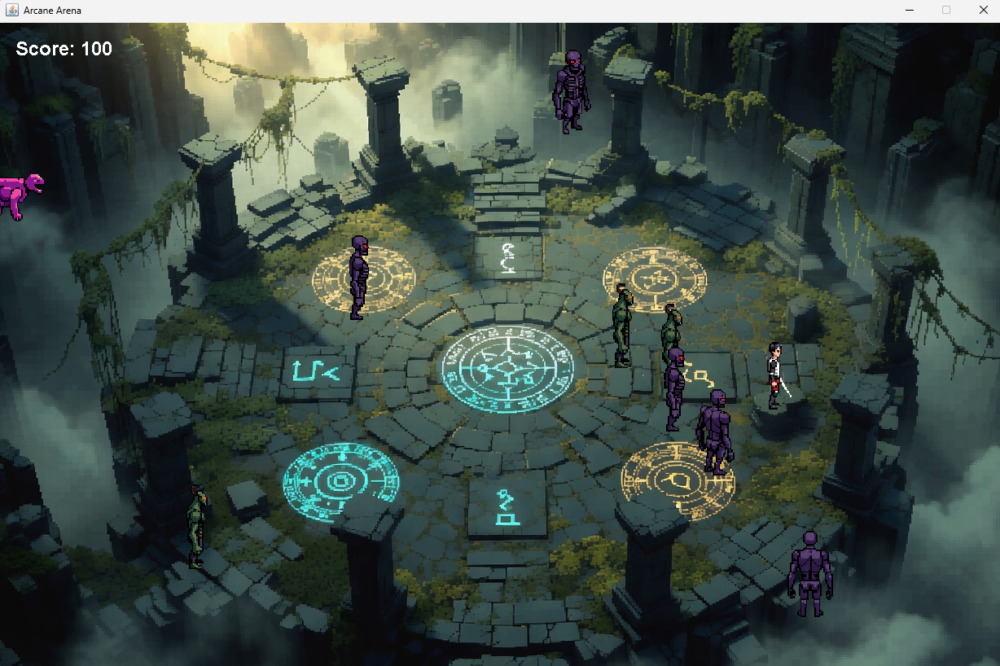

# Arcane Arena

A simple indie game inspired from a game I always play lol

Arcane Arena is a Java action game set in a mysterious floating arena. Fight waves of monsters, use your abilities, and chase a higher score each run.

## Gameplay




## Features

- Wave-based arena combat
- Mouse-controlled movement and aiming
- Dash and ranged attack abilities
- Score tracking and a top-score leaderboard
- Pixel-art monsters, effects, and environment assets

## Controls

| Input | Action |
| --- | --- |
| Right-click | Move toward a target |
| Mouse | Aim |
| `Q` | Shoot |
| `E` | Dash |

## Running the game

### Requirements

- Java 21
- Maven
- MySQL, if leaderboard persistence is enabled

From the project directory:

```bash
cd FINALS_JAVA
mvn compile
mvn exec:java
```

The game entry point is `com.mycompany.finals_java.FINALS_JAVA`.

## Project structure

```text
FINALS_JAVA/
├── pom.xml
└── src/
    └── main/
        ├── java/
        └── resources/images/
```

## Inspiration

Built as an indie finals project and inspired by the games I enjoy playing.
